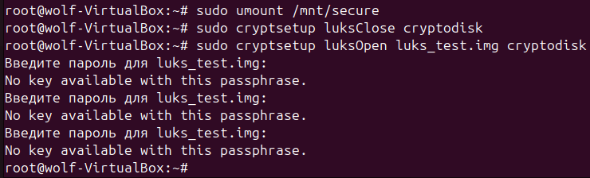
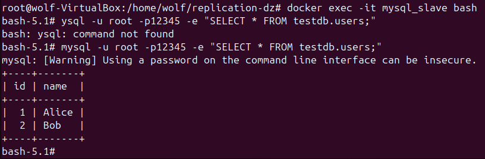

# Домашнее задание к занятию "`Репликация и масштабирование. Часть 1`" - `Тесаев Максим`

### Инструкция по выполнению домашнего задания

   1. Сделайте `fork` данного репозитория к себе в Github и переименуйте его по названию или номеру занятия, например, https://github.com/имя-вашего-репозитория/git-hw или  https://github.com/имя-вашего-репозитория/7-1-ansible-hw).
   2. Выполните клонирование данного репозитория к себе на ПК с помощью команды `git clone`.
   3. Выполните домашнее задание и заполните у себя локально этот файл README.md:
      - впишите вверху название занятия и вашу фамилию и имя
      - в каждом задании добавьте решение в требуемом виде (текст/код/скриншоты/ссылка)
      - для корректного добавления скриншотов воспользуйтесь [инструкцией "Как вставить скриншот в шаблон с решением](https://github.com/netology-code/sys-pattern-homework/blob/main/screen-instruction.md)
      - при оформлении используйте возможности языка разметки md (коротко об этом можно посмотреть в [инструкции  по MarkDown](https://github.com/netology-code/sys-pattern-homework/blob/main/md-instruction.md))
   4. После завершения работы над домашним заданием сделайте коммит (`git commit -m "comment"`) и отправьте его на Github (`git push origin`);
   5. Для проверки домашнего задания преподавателем в личном кабинете прикрепите и отправьте ссылку на решение в виде md-файла в вашем Github.
   6. Любые вопросы по выполнению заданий спрашивайте в чате учебной группы и/или в разделе “Вопросы по заданию” в личном кабинете.
   
Желаем успехов в выполнении домашнего задания!
   
### Дополнительные материалы, которые могут быть полезны для выполнения задания

1. [Руководство по оформлению Markdown файлов](https://gist.github.com/Jekins/2bf2d0638163f1294637#Code)

---

### Задание 1

На лекции рассматривались режимы репликации master-slave, master-master, опишите их различия.  
*Ответить в свободной форме.*  

### Решение

Репликация — это процесс копирования данных с одного сервера базы данных на другой, чтобы обеспечить отказоустойчивость, балансировку нагрузки или резервное копирование. Существуют разные режимы репликации, среди которых наиболее распространённые — master-slave и master-master.  
1. Master-Slave (ведущий–ведомый)
* Сущность: один сервер выступает как master (главный), остальные — как slave (ведомые).
* Принцип работы: все изменения (запись, обновление, удаление) выполняются только на master-сервере. Slave-серверы получают копию этих изменений и синхронизируются с master.
* Использование: чтение данных можно распределять между slave-серверами, снижая нагрузку на master.
* Недостаток: если master выйдет из строя, запись данных станет невозможной, пока не произойдёт переключение ролей или восстановление.
2. Master-Master (ведущий–ведущий)
* Сущность: оба (или несколько) серверов являются master, и каждый может выполнять операции записи и чтения.
* Принцип работы: изменения, сделанные на любом из master-серверов, реплицируются на другие.
* Преимущества: повышенная отказоустойчивость (если один сервер падает, другой продолжает работать) и возможность балансировки нагрузки как на запись, так и на чтение.
* Недостаток: возможны конфликты данных, когда одно и то же значение изменяется одновременно на разных master-серверах, поэтому требуется механизм их разрешения.

---

### Задание 2

Выполните конфигурацию master-slave репликации, примером можно пользоваться из лекции.  
*Приложите скриншоты конфигурации, выполнения работы: состояния и режимы работы серверов.*

### Решение

