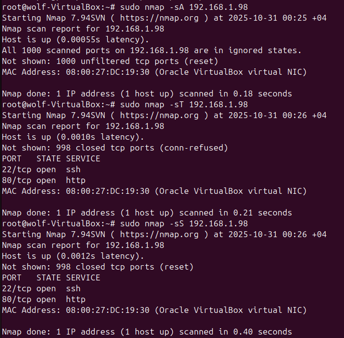
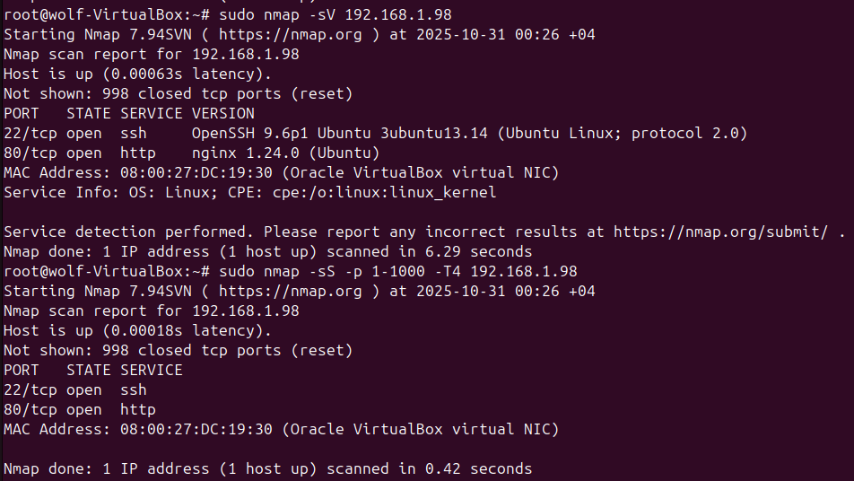
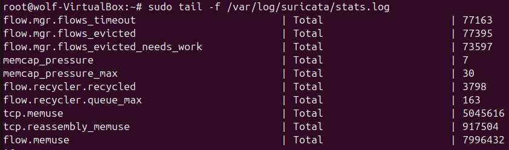
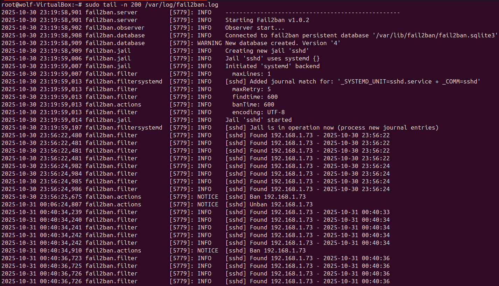

# Домашнее задание к занятию "`Защита сети`" - `Тесаев Максим`

### Инструкция по выполнению домашнего задания

   1. Сделайте `fork` данного репозитория к себе в Github и переименуйте его по названию или номеру занятия, например, https://github.com/имя-вашего-репозитория/git-hw или  https://github.com/имя-вашего-репозитория/7-1-ansible-hw).
   2. Выполните клонирование данного репозитория к себе на ПК с помощью команды `git clone`.
   3. Выполните домашнее задание и заполните у себя локально этот файл README.md:
      - впишите вверху название занятия и вашу фамилию и имя
      - в каждом задании добавьте решение в требуемом виде (текст/код/скриншоты/ссылка)
      - для корректного добавления скриншотов воспользуйтесь [инструкцией "Как вставить скриншот в шаблон с решением](https://github.com/netology-code/sys-pattern-homework/blob/main/screen-instruction.md)
      - при оформлении используйте возможности языка разметки md (коротко об этом можно посмотреть в [инструкции  по MarkDown](https://github.com/netology-code/sys-pattern-homework/blob/main/md-instruction.md))
   4. После завершения работы над домашним заданием сделайте коммит (`git commit -m "comment"`) и отправьте его на Github (`git push origin`);
   5. Для проверки домашнего задания преподавателем в личном кабинете прикрепите и отправьте ссылку на решение в виде md-файла в вашем Github.
   6. Любые вопросы по выполнению заданий спрашивайте в чате учебной группы и/или в разделе “Вопросы по заданию” в личном кабинете.
   
Желаем успехов в выполнении домашнего задания!
   
### Дополнительные материалы, которые могут быть полезны для выполнения задания

1. [Руководство по оформлению Markdown файлов](https://gist.github.com/Jekins/2bf2d0638163f1294637#Code)

---

### Подготовка к выполнению заданий

1. Подготовка защищаемой системы:
* установите Suricata,
* установите Fail2Ban.
2. Подготовка системы злоумышленника: установите nmap и thc-hydra либо скачайте и установите Kali linux.

Обе системы должны находится в одной подсети.

### Задание 1

Проведите разведку системы и определите, какие сетевые службы запущены на защищаемой системе:  
**sudo nmap -sA < ip-адрес >**  
**sudo nmap -sT < ip-адрес >**  
**sudo nmap -sS < ip-адрес >**  
**sudo nmap -sV < ip-адрес >**  
По желанию можете поэкспериментировать с опциями: https://nmap.org/man/ru/man-briefoptions.html.  
*В качестве ответа пришлите события, которые попали в логи Suricata и Fail2Ban, прокомментируйте результат.*  

### Задание 2

Проведите атаку на подбор пароля для службы SSH:  
**hydra -L users.txt -P pass.txt < ip-адрес > ssh**
1. Настройка hydra:
* создайте два файла: users.txt и pass.txt;
* в каждой строчке первого файла должны быть имена пользователей, второго — пароли. В нашем случае это могут быть случайные строки, но ради эксперимента можете добавить имя и пароль существующего пользователя.

Дополнительная информация по hydra: https://kali.tools/?p=1847.
2. Включение защиты SSH для Fail2Ban:
* открыть файл /etc/fail2ban/jail.conf,
* найти секцию ssh,
* установить enabled в true.

Дополнительная информация по Fail2Ban:https://putty.org.ru/articles/fail2ban-ssh.html.  
*В качестве ответа пришлите события, которые попали в логи Suricata и Fail2Ban, прокомментируйте результат.*

### Решение







```java
0/30/2025-23:49:33.939885  [**] [1:2221010:1] SURICATA HTTP unable to match response to request [**] [Classification: Generic Protocol Command Decode] [Priority: 3] {TCP} 192.168.>
10/30/2025-23:49:35.991217  [**] [1:2221010:1] SURICATA HTTP unable to match response to request [**] [Classification: Generic Protocol Command Decode] [Priority: 3] {TCP} 192.168.>
10/30/2025-23:49:41.899314  [**] [1:2221010:1] SURICATA HTTP unable to match response to request [**] [Classification: Generic Protocol Command Decode] [Priority: 3] {TCP} 192.168.>
10/30/2025-23:49:53.920200  [**] [1:2221010:1] SURICATA HTTP unable to match response to request [**] [Classification: Generic Protocol Command Decode] [Priority: 3] {TCP} 192.168.>
10/30/2025-23:49:55.967717  [**] [1:2260002:1] SURICATA Applayer Detect protocol only one direction [**] [Classification: Generic Protocol Command Decode] [Priority: 3] {TCP} 192.1>
10/30/2025-23:49:59.981077  [**] [1:2260002:1] SURICATA Applayer Detect protocol only one direction [**] [Classification: Generic Protocol Command Decode] [Priority: 3] {TCP} 192.1>
10/30/2025-23:50:08.991156  [**] [1:2221010:1] SURICATA HTTP unable to match response to request [**] [Classification: Generic Protocol Command Decode] [Priority: 3] {TCP} 192.168.>
10/30/2025-23:50:14.973241  [**] [1:2260002:1] SURICATA Applayer Detect protocol only one direction [**] [Classification: Generic Protocol Command Decode] [Priority: 3] {TCP} 192.1>
10/30/2025-23:50:15.003113  [**] [1:2260002:1] SURICATA Applayer Detect protocol only one direction [**] [Classification: Generic Protocol Command Decode] [Priority: 3] {TCP} 192.1>
10/30/2025-23:50:21.941652  [**] [1:2260002:1] SURICATA Applayer Detect protocol only one direction [**] [Classification: Generic Protocol Command Decode] [Priority: 3] {TCP} 192.1>
10/30/2025-23:50:21.965161  [**] [1:2260002:1] SURICATA Applayer Detect protocol only one direction [**] [Classification: Generic Protocol Command Decode] [Priority: 3] {TCP} 192.1>
10/30/2025-23:50:31.939886  [**] [1:2260002:1] SURICATA Applayer Detect protocol only one direction [**] [Classification: Generic Protocol Command Decode] [Priority: 3] {TCP} 192.1>
10/30/2025-23:50:32.964104  [**] [1:2260002:1] SURICATA Applayer Detect protocol only one direction [**] [Classification: Generic Protocol Command Decode] [Priority: 3] {TCP} 192.1>
10/30/2025-23:55:52.219507  [**] [1:2013504:6] ET INFO GNU/Linux APT User-Agent Outbound likely related to package management [**] [Classification: Not Suspicious Traffic] [Priorit>
10/30/2025-23:55:52.418523  [**] [1:2013504:6] ET INFO GNU/Linux APT User-Agent Outbound likely related to package management [**] [Classification: Not Suspicious Traffic] [Priorit>
10/30/2025-23:55:52.418523  [**] [1:2013504:6] ET INFO GNU/Linux APT User-Agent Outbound likely related to package management [**] [Classification: Not Suspicious Traffic] [Priorit>
10/30/2025-23:55:52.418523  [**] [1:2013504:6] ET INFO GNU/Linux APT User-Agent Outbound likely related to package management [**] [Classification: Not Suspicious Traffic] [Priorit>
10/30/2025-23:55:52.418523  [**] [1:2013504:6] ET INFO GNU/Linux APT User-Agent Outbound likely related to package management [**] [Classification: Not Suspicious Traffic] [Priorit>
10/30/2025-23:55:52.568376  [**] [1:2210054:1] SURICATA STREAM excessive retransmissions [**] [Classification: Generic Protocol Command Decode] [Priority: 3] {TCP} 192.168.1.98:460>
10/30/2025-23:56:29.127804  [**] [1:2210054:1] SURICATA STREAM excessive retransmissions [**] [Classification: Generic Protocol Command Decode] [Priority: 3] {TCP} 192.168.1.73:395>
10/30/2025-23:56:29.128286  [**] [1:2210054:1] SURICATA STREAM excessive retransmissions [**] [Classification: Generic Protocol Command Decode] [Priority: 3] {TCP} 192.168.1.73:395>
10/31/2025-00:00:05.198660  [**] [1:2056212:1] ET INFO Internet Printing Protocol (IPP) Get-Printer-Attributes Outbound Request [**] [Classification: Misc activity] [Priority: 3] {>
10/31/2025-00:18:16.155359  [**] [1:2210044:2] SURICATA STREAM Packet with invalid timestamp [**] [Classification: Generic Protocol Command Decode] [Priority: 3] {TCP} 140.82.121.4>
10/31/2025-00:18:16.155631  [**] [1:2210044:2] SURICATA STREAM Packet with invalid timestamp [**] [Classification: Generic Protocol Command Decode] [Priority: 3] {TCP} 140.82.121.4>
10/31/2025-00:18:16.156864  [**] [1:2210044:2] SURICATA STREAM Packet with invalid timestamp [**] [Classification: Generic Protocol Command Decode] [Priority: 3] {TCP} 140.82.121.4>
10/31/2025-00:18:16.157137  [**] [1:2210044:2] SURICATA STREAM Packet with invalid timestamp [**] [Classification: Generic Protocol Command Decode] [Priority: 3] {TCP} 140.82.121.4>
10/31/2025-00:18:16.157239  [**] [1:2210044:2] SURICATA STREAM Packet with invalid timestamp [**] [Classification: Generic Protocol Command Decode] [Priority: 3] {TCP} 140.82.121.4>
10/31/2025-00:18:16.157559  [**] [1:2210044:2] SURICATA STREAM Packet with invalid timestamp [**] [Classification: Generic Protocol Command Decode] [Priority: 3] {TCP} 140.82.121.4>
10/31/2025-00:18:16.158005  [**] [1:2210044:2] SURICATA STREAM Packet with invalid timestamp [**] [Classification: Generic Protocol Command Decode] [Priority: 3] {TCP} 140.82.121.4>
10/31/2025-00:26:45.509186  [**] [1:2024364:5] ET SCAN Possible Nmap User-Agent Observed [**] [Classification: Web Application Attack] [Priority: 1] {TCP} 192.168.1.73:56188 -> 192>
10/31/2025-00:26:45.509181  [**] [1:2024364:5] ET SCAN Possible Nmap User-Agent Observed [**] [Classification: Web Application Attack] [Priority: 1] {TCP} 192.168.1.73:56202 -> 192>
10/31/2025-00:26:45.511626  [**] [1:2024364:5] ET SCAN Possible Nmap User-Agent Observed [**] [Classification: Web Application Attack] [Priority: 1] {TCP} 192.168.1.73:56208 -> 192>
10/31/2025-00:26:45.512064  [**] [1:2024364:5] ET SCAN Possible Nmap User-Agent Observed [**] [Classification: Web Application Attack] [Priority: 1] {TCP} 192.168.1.73:56210 -> 192>
```

---

Фрагменты из /var/log/suricata/fast.log:
```java
[**] [1:2024364:5] ET SCAN Possible Nmap User-Agent Observed [**]
[Classification: Web Application Attack] [Priority: 1] {TCP} 192.168.1.73 -> 192.168.1.98:80
```
* Что это значит:  
Suricata обнаружила характерные признаки сканирования порта с помощью Nmap.  
Сигнатура ET SCAN Possible Nmap User-Agent Observed — это правило из набора Emerging Threats (ET), которое срабатывает, если в HTTP-запросе виден заголовок User-Agent со значением, типичным для Nmap (Nmap Scripting Engine, libwww, и т.д.).
* Источник атаки:  
192.168.1.73 — это IP злоумышленника (машина, с которой запускался nmap).
* Цель атаки:  
192.168.1.98 — это защищаемая система (где установлена Suricata).
* Тип трафика:  
TCP -> 80 порт — попытки сканирования веб-сервиса.
* Вывод:  
Suricata успешно обнаружила и зарегистрировала факт сетевой разведки с помощью Nmap.  
Это подтверждает, что IDS (Intrusion Detection System) работает корректно и реагирует на подозрительную активность в сети.

Фрагмент из /var/log/fail2ban.log:
```java
2025-10-30 23:56:22,481 fail2ban.filter [5779]: INFO [sshd] Found 192.168.1.73
2025-10-30 23:56:25,675 fail2ban.actions [5779]: NOTICE [sshd] Ban 192.168.1.73
```
* Что это значит:  
Fail2Ban обнаружил несколько неудачных попыток входа по SSH с IP-адреса 192.168.1.73 (атакующая машина, с которой запускался Hydra).  
После превышения лимита неудачных входов (по умолчанию 5 попыток за 10 минут), IP-адрес был заблокирован.  
* Реакция системы:  
Fail2Ban добавил правило в iptables (или nftables), которое блокирует весь входящий трафик с указанного IP на время, заданное в параметре bantime (в нашем случае 600 секунд = 10 минут).
* Вывод:  
Fail2Ban успешно сработал как IPS (Intrusion Prevention System) — не только зафиксировал попытку подбора пароля, но и предотвратил дальнейшие подключения атакующего хоста.
